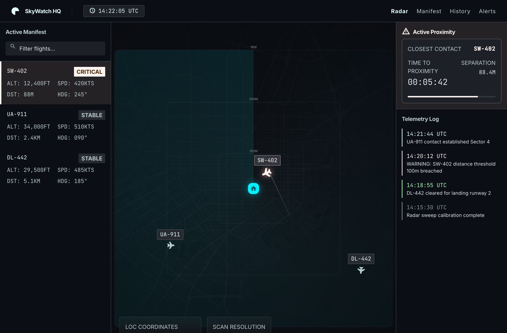
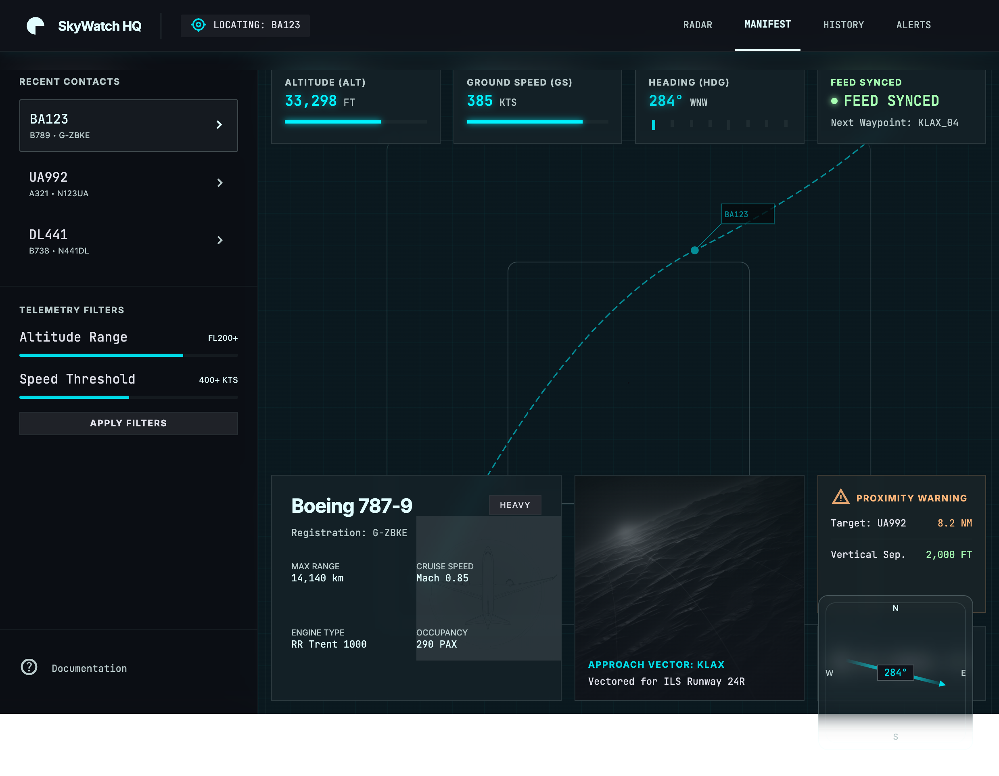
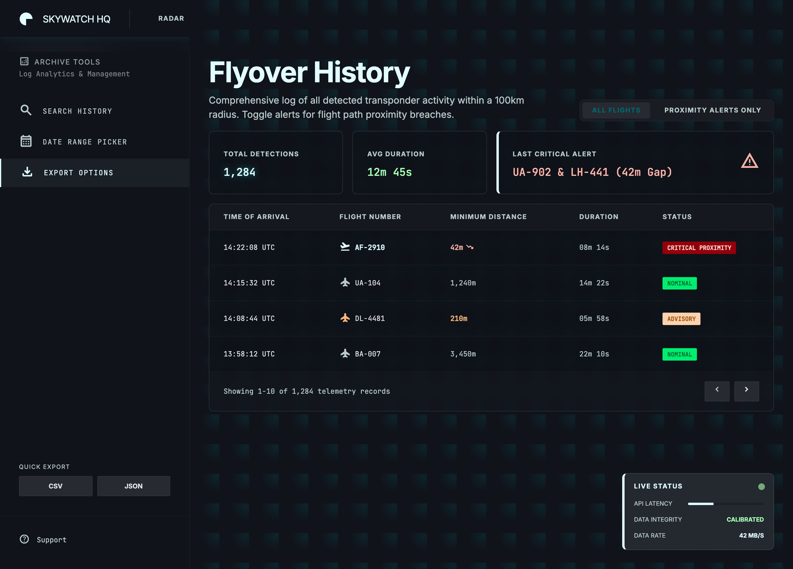
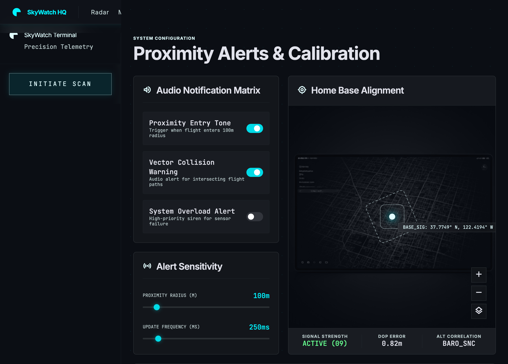

# SkyWatch HQ

A personal flight-monitoring dashboard that shows aircraft passing near your location using live ADS-B data from the [OpenSky Network](https://opensky-network.org/). The UI is a multi-page tactical “glass cockpit” site; the backend ingests real transponder positions, classifies proximity risk, and persists flyover history.

<p align="center">
  
  <br />
  <sub><em>Live radar dashboard — Google Stitch “Aeronautical Precision” design, wired to OpenSky ADS-B</em></sub>
</p>

## Screens

UI mockups from [Google Stitch](skywatch-google-stitch/aeronautical_precision/DESIGN.md) (`skywatch-google-stitch/`). The running app in `site/` follows this visual language with live data.

<table>
  <tr>
    <td align="center" width="50%">
      <a href="site/index.html">
        
      </a>
      <br /><b>Radar</b> — PPI scope, manifest, proximity panel
    </td>
    <td align="center" width="50%">
      <a href="site/manifest.html">
        
      </a>
      <br /><b>Manifest</b> — per-aircraft telemetry &amp; metadata
    </td>
  </tr>
  <tr>
    <td align="center">
      <a href="site/history.html">
        
      </a>
      <br /><b>History</b> — flyover archive, filters, export
    </td>
    <td align="center">
      <a href="site/alerts.html">
        
      </a>
      <br /><b>Alerts</b> — proximity calibration &amp; audio toggles
    </td>
  </tr>
</table>

## Purpose

SkyWatch answers a simple question: **what is flying near my home, and how close is it getting?**

- Uses your **browser geolocation** (or configured fallback coordinates) as the monitoring point
- Tracks aircraft within a **10 km** data window from OpenSky
- Displays them on a **5 km tactical radar** (500 m / 1 km / 5 km range rings) with smooth position animation
- Classifies each aircraft as **CRITICAL**, **WARNING**, or **STABLE** based on distance from your location
- Logs flyovers to a local SQLite database for the History and Alerts incident views
- Optional **audio alerts** on the Radar page when proximity or feed status changes

This is a personal / non-commercial monitoring tool. OpenSky data is subject to their [terms of use](https://opensky-network.org/about/faq).

---

## Quick start

### Prerequisites

- Python 3.9+
- A modern browser with geolocation support (for live radar/manifest)
- [OpenSky API OAuth credentials](https://opensky-network.org/) (strongly recommended)

### 1. Backend

```bash
cd backend
pip install -r requirements.txt
python3 -m uvicorn main:app --reload --port 8000
```

### 2. OpenSky credentials

Copy the example file and add your API client credentials from the OpenSky portal:

```bash
cp credentials.json.example credentials.json
# Edit credentials.json — never commit this file
```

Format (camelCase or snake_case both work):

```json
{
  "clientId": "your-api-client-id",
  "clientSecret": "your-api-client-secret"
}
```

Without credentials, requests are anonymous and heavily rate-limited.

### 3. Frontend

Serve the static site (separate terminal):

```bash
cd site
python3 -m http.server 8080
```

Open **http://localhost:8080** and allow location access when prompted.

### 4. Audio alerts (optional)

Drop sound files into `site/audio/` — see `site/audio/README.md`. At minimum, add `alert.mp3` for all alert types. Enable toggles on the **Alerts** page; sounds fire on the **Radar** page.

### Custom API host

If the backend is not on port 8000, set this before the page scripts load:

```html
<script>window.SKYWATCH_API = "http://your-host:8000";</script>
```

---

## Pages (`site/`)

| Page | File | Status | Description |
|------|------|--------|-------------|
| **Radar** | `index.html` | Live | Home screen. 5 km PPI-style radar, active manifest, proximity panel, telemetry log, search. Uses WebSocket + geolocation. |
| **Manifest** | `manifest.html` | Live | Per-aircraft telemetry detail: altitude, speed, heading, aircraft metadata, recent contacts. Open via `?icao24=` or click a flight on Radar. |
| **History** | `history.html` | Live | Flyover log from SQLite with stats, filters, and CSV/JSON export. |
| **Alerts** | `alerts.html` | Live | Proximity radius, refresh interval, base coordinates, audio toggles, and incident log. Saves config to backend. |

Shared: `site/shared.css`, `site/audio-alerts.js`

### Radar (`index.html` + `radar.js`)

- **Geolocation** → sends `{ type: "set_location", lat, lon }` over WebSocket on connect; falls back to saved config coordinates if denied
- **Active Manifest** — aircraft within **5 km**, label shows `< 5km`
- **Radar blips** — same 5 km scope; smoothstep interpolation between frames, heading lerp, measured frame-gap timing
- **Search** — filter manifest and blips by callsign or ICAO24
- **Proximity sidebar** — closest aircraft, separation, ETA bar; ring ping when any contact is CRITICAL
- **Telemetry log** — contact and status-change events within 5 km
- **Audio** — proximity / advisory / feed-fault tones (if enabled on Alerts page)
- Click a manifest card or blip → **Manifest** page for that flight
- Auto-reconnects WebSocket on disconnect, reusing last known coordinates

### Manifest (`manifest.html` + `manifest.js`)

- Live telemetry from WebSocket (same `set_location` handshake as Radar)
- Aircraft specs from `GET /api/aircraft/{icao24}` (OpenSky metadata registry)
- **Recent Contacts** sidebar — other aircraft within 5 km
- URL-driven selection: `manifest.html?icao24=abcdef`

### History (`history.html` + `history.js`)

- `GET /api/history` — loads up to 100 records; optional `status` filter (`CRITICAL` via “Alerts only” button)
- **Client-side filters** — callsign/ICAO search, date range on `last_seen`
- **Stats** — total detections (server), average track duration (visible records), last detection time
- **Export** — CSV or JSON of currently visible (filtered) records
- Expandable rows with link to Manifest

### Alerts (`alerts.html` + `alerts.js`)

- `GET` / `PUT /api/alerts/config`
- **Proximity radius** (10 m – 5 km) — inside this distance = CRITICAL
- **Update interval** (60 s – 300 s) — how often the backend polls OpenSky (default **120 s**)
- **Base coordinates** — shows live geolocation when available; **Save Config** persists as fallback when GPS is denied
- **Audio toggles** — proximity entry, advisory range, feed fault (stored in `localStorage`; sounds play on Radar)
- **Incident log** — recent CRITICAL/WARNING flyovers from `GET /api/history?limit=20`

---

## Audio alerts (`site/audio-alerts.js`)

Client-side alert sounds, configured on Alerts, triggered on Radar:

| Toggle | Fires when |
|--------|------------|
| Proximity entry | Aircraft enters CRITICAL range (or first contact already CRITICAL) |
| Advisory range | Aircraft enters WARNING range |
| Feed fault | OpenSky feed errors or rate-limits (`feed_status` transition) |

- Preferences persist in `localStorage` (`sw_audio_*` keys)
- Drop clips in `site/audio/` — `proximity.mp3`, `collision.mp3`, `overload.mp3`, or a single `alert.mp3` fallback
- Browser autoplay policy: first user gesture primes audio; toggle-on plays a preview

---

## Architecture

```
Browser (site/)                    Backend (backend/)              OpenSky
─────────────────                  ──────────────────              ────────
index.html  ──WebSocket──────────► main.py /ws/radar
manifest.html    set_location         │
                                     opensky.py (shared cache)
                                     opensky_auth.py (OAuth)  ──► /states/all
                                     db.py (SQLite)           ◄── flyover log
history.html  ──REST─────────────► /api/history
alerts.html   ──REST─────────────► /api/alerts/config
manifest.html ──REST─────────────► /api/aircraft/{icao24} ─────► metadata API
```

**Live positions** come from OpenSky **state vectors** (WebSocket feed).  
**Aircraft type / registration** come from the separate **metadata** API (cached 24 h server-side).

### Proximity classification

| Status | Condition |
|--------|-----------|
| `CRITICAL` | `distance_m ≤ proximity_radius_m` |
| `WARNING` | `distance_m ≤ proximity_radius_m × 3` |
| `STABLE` | farther than warning range |

Default proximity radius: **500 m** (configurable on Alerts).

### Rate limiting & caching

- **Shared OpenSky cache** — one `/states/all` call serves all connected WebSocket clients
- **Minimum fetch interval** — 5 s with OAuth credentials, 10 s anonymous (enforced globally)
- **User refresh interval** — configurable 60–300 s (default **120 s**); controls WebSocket update cadence and radar animation duration
- **429 handling** — serves stale cached data; `feed_status` and `retry_after_s` surfaced in API and UI
- **Tab stagger** — new WebSocket connections wait out any in-flight cache cooldown before first fetch

### Flyover persistence

On each successful OpenSky fetch, aircraft are upserted into SQLite. Records for the same `icao24` within a **1-hour window** update `last_seen`, `min_distance_m`, and `status` rather than creating duplicates.

---

## API reference

| Method | Endpoint | Description |
|--------|----------|-------------|
| `WS` | `/ws/radar` | Live radar feed. Client must first send `{"type":"set_location","lat":…,"lon":…}` within 15 s |
| `GET` | `/api/status` | Feed health, aircraft count, rate-limit state |
| `GET` | `/api/alerts/config` | Current alert/base configuration |
| `PUT` | `/api/alerts/config` | Update configuration |
| `GET` | `/api/history?limit=&status=` | Flyover records + stats (`limit` 1–500) |
| `GET` | `/api/aircraft/{icao24}` | Aircraft metadata (6-char hex ICAO24) |

### WebSocket frame (`RadarFrame`)

```json
{
  "aircraft": [{ "icao24", "callsign", "lat", "lon", "altitude_ft", "speed_kts",
                 "heading", "distance_m", "vertical_rate", "on_ground", "status" }],
  "base_lat": 51.5074,
  "base_lon": -0.1278,
  "proximity_radius_m": 500,
  "timestamp": "14:22:05",
  "total_count": 12,
  "feed_status": "ok",
  "retry_after_s": 0,
  "update_interval_ms": 120000
}
```

`feed_status`: `ok` | `stale` | `rate_limited` | `error`

### History response

```json
{
  "records": [{ "id", "icao24", "callsign", "first_seen", "last_seen",
                "min_distance_m", "max_altitude_ft", "aircraft_type", "status" }],
  "stats": {
    "total_detections": 42,
    "proximity_alerts": 7,
    "last_detection": "2026-06-06 14:22:05"
  }
}
```

---

## Project structure

```
skywatch/
├── README.md                 # This file
├── site/                     # Frontend (active) — open this in the browser
│   ├── index.html            # Radar
│   ├── manifest.html         # Flight telemetry detail
│   ├── history.html          # Flyover history
│   ├── alerts.html           # Alerts & calibration
│   ├── shared.css            # Shared design tokens & components
│   ├── radar.js
│   ├── manifest.js
│   ├── history.js
│   ├── alerts.js
│   ├── audio-alerts.js       # Shared audio alert module
│   └── audio/                # Optional alert sound clips (see audio/README.md)
├── backend/                  # FastAPI + SQLite + OpenSky client
│   ├── main.py               # REST + WebSocket routes
│   ├── opensky.py            # Live state fetch + shared cache
│   ├── opensky_auth.py       # OAuth2 token manager
│   ├── models.py             # Pydantic models
│   ├── db.py                 # SQLite schema & queries
│   ├── requirements.txt
│   ├── credentials.json      # Gitignored — your OpenSky OAuth secrets
│   └── credentials.json.example
├── skywatch-google-stitch/   # Original Google Stitch design HTML + DESIGN.md
└── SkyWatch - Claude Design/ # Earlier prototype (simulated data)
```

The **`site/`** and **`backend/`** folders are the running application. The other directories are design references and prototypes.

---

## Configuration defaults

| Setting | Default | Range | Notes |
|---------|---------|-------|-------|
| `proximity_radius_m` | 500 m | 10 m – 5 km | CRITICAL threshold |
| `update_interval_ms` | 120 000 ms | 60 s – 300 s | Poll + animation period |
| `base_lat` / `base_lon` | London | valid lat/lon | Fallback if GPS denied |
| Radar / manifest scope | 5 km | fixed in JS | `RADAR_RANGE_M` / `PANEL_RADIUS_M` |
| OpenSky fetch bbox | 10 km | fixed in backend | Around client location |
| OpenSky min interval | 5 s / 10 s | — | 5 s with OAuth, 10 s anonymous |

---

## Development notes

- **Database**: `backend/skywatch.db` (auto-created, gitignored). Existing DBs are migrated to 120 s refresh if previously set lower.
- **CORS**: enabled for all origins (local dev). Tighten before public deployment.
- **Security**: never commit `credentials.json` or `.env`. Backend validates ICAO24, coordinates, and history query params. Frontend escapes API-sourced strings before `innerHTML`. No API authentication — intended for localhost use.
- **Design**: UI based on Google Stitch “Aeronautical Precision” screens; typography uses Inter + JetBrains Mono.

### Run backend without reload

```bash
cd backend && python3 -m uvicorn main:app --port 8000
```

### Check API health

```bash
curl http://localhost:8000/api/status
```

---

## Limitations

- **No flight paths** — positions are point samples, not full trajectories (map SVG on Manifest is decorative)
- **Metadata gaps** — OpenSky registry may lack engine/operator details for some aircraft
- **Geolocation required** for best results on Radar/Manifest; otherwise Alerts base coordinates are used
- **OpenSky coverage** — depends on ADS-B receiver network density in your area
- **Single-user local setup** — no authentication on the API; not production-hardened
- **Audio requires user interaction** — browsers block autoplay until the first click/keypress

---

## License & data

Flight data © [OpenSky Network](https://opensky-network.org/). Use in accordance with their API terms. SkyWatch application code is provided as-is for personal monitoring.
